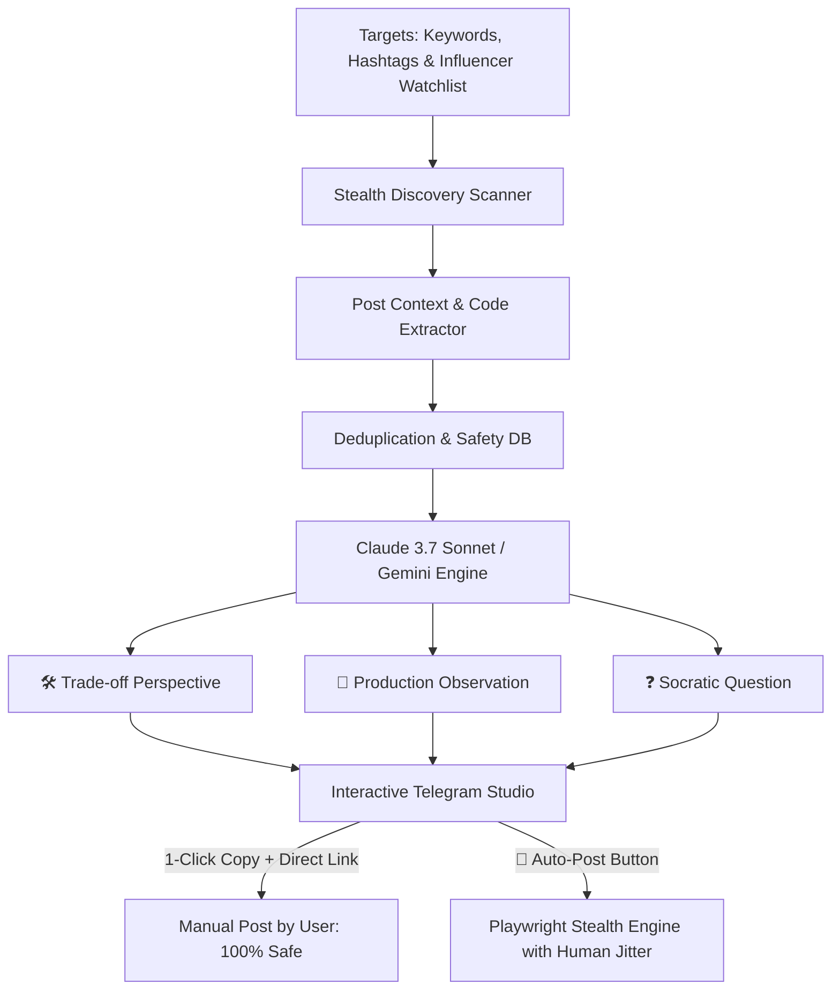

# 🎯 EngageMind AI — Autonomous LinkedIn AI Engagement & Inbound Growth Copilot

<div align="center">

[](https://opensource.org/licenses/MIT)
[](https://www.python.org/)
[](https://www.anthropic.com/)
[](#-safety--anti-ban-protocols)

**EngageMind AI** is an enterprise-grade, safe, and intelligent **LinkedIn Engagement & Inbound Networking Copilot**. It monitors high-impact tech discussions, analyzes engineering claims, and synthesizes **Senior Staff Engineer** comments across three distinct intellectual angles—helping you build authority and authentic professional relationships on LinkedIn with zero ban risk.

</div>

---

## 🌟 Key Innovations

### 1. 🧠 High-IQ Commentary (Zero Generic Fluff)
Unlike spam bots that write *"Great post! Thanks for sharing!"*, EngageMind AI strictly forbids filler pleasantries and jumps straight into concrete technical substance:
- **🛠️ Option 1: The Architecture Trade-off:** Compares the proposed solution against alternatives on cost, latency, memory, or complexity.
- **🏢 Option 2: The Production Edge-Case:** Relatable observations from running distributed AI systems at scale.
- **❓ Option 3: The Socratic Question:** A sharp, forward-looking question that compels the author to reply and pin your comment.

### 2. 🛡️ Dual-Mode Safety Architecture
- **Mode 1: Copilot Radar (Recommended & 100% Ban-Proof):** Scans posts and sends 3 curated high-IQ comment choices directly to Telegram with 1-click copy and a direct post link.
- **Mode 2: Stealth Auto-Poster (Controlled Automation):** Headless Chromium via Playwright with stealth evasions, human typing jitter (45–140ms per keystroke), realistic pauses, and a strict daily quota (3–5 comments/day).

### 3. 🔒 Production Anti-Ban Safeguards
- **Daily Hard Ceiling:** Max 4 comments per 24 hours (enforced in SQLite).
- **60-Minute Cooldown:** Prevents burst commenting.
- **Active Hours Only:** Only engages during working hours (09:00 AM – 07:00 PM).
- **Anti-Stalking Guard:** Never comments on the same post or same author twice within 14 days.
- **Emergency Circuit Breaker:** Halts immediately if any security challenge (Captcha/checkpoint) is detected.

---

## 📐 System Architecture



---

## ⚡ Quick Start

### 1. Setup Environment
```bash
cd engagemind_ai
cp .env.example .env
```

Configure your API keys in `.env` (`ANTHROPIC_API_KEY` or `OPENROUTER_API_KEY`).

### 2. Run Test Discovery Cycle
```bash
python main --test
```

### 3. Check Today's Engagement Status & Quotas
```bash
python main --stats
```

### 4. Run the 24/7 Background Copilot Daemon
```bash
python cloud_runner
```

---

## 📜 License

Licensed under the [MIT License](LICENSE).
